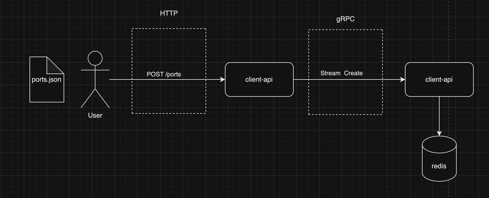

# Port Service

This project proposes a solution to stream large files using API Rest and gRPC

# Introduction

The problem that this service proposes to resolve is the sending large files to a server, in a scenario where there is no
scontrol over the size of the files that are sent to the server, with service running with limited processing resources.

In the proposal approach, the `ports.json` file is read in chunks using HTTP stream, parsed to JSON and streamed to the 
server using gRPC, and saves the port objects in a redis database


The project is divided into 3 layers, which generate 3 different images when the build is run, namely:
* **server**: responsible for exposing a gRPC server and connect with the database.
* **client-api**: responsible for exposing a rest API to receive the client requests and communicate with the gRPC server.
* **redis**: an instance of redis responsible to save ports information.




# Setup

### Prerequisites

* [**Docker**](https://www.docker.com/products/docker-desktop/) (>= 24.0.5) and 
[**Docker-compose**](https://docs.docker.com/compose/install/) (>= 2.20.3) - run containers
* [**Go**](https://go.dev/dl/) (>= 1.20) - run tests
* [**golangci-lint**](https://github.com/golangci/golangci-lint) (>= 1.40) - run linter

### Execution

To build the containers, run:
```shell
make build
```

To execute the application, run:
```shell
make run
```

And to stop the application, use:
```shell
make stop
```

### Usage

If everything goes well, the API Rest server will run on port `8000`. 

To upload a JSON file, use this endpoint:

> **_NOTES:_**  
> * Change the file location or add the file as a `binary` in the body before making the request.
> * The file must be in the same format as the `ports.json` file in the `static` folder.

``` curl
curl --location --request POST 'http://localhost:8000/port' /
--data '@<file-location>/ports.json'
```

To find a port by ID, use this endpoint:

``` curl
curl --location 'http://localhost:8000/port/<port-id>'
```

### Tests

To run the tests, use the following command:
```shell
make test
```

### Linter

To run the linter, use the following command:
```shell
make lint
```

# Future works
For the evolution and improvement of the project, it would be interesting:

* Add security method on Rest API, gRPC and database connection endpoints
* Improve error handling for REST and gRPC communications


